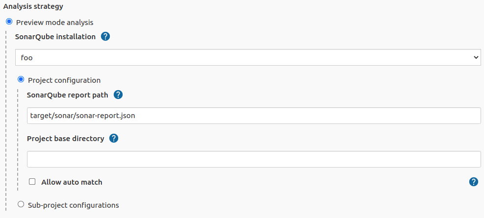
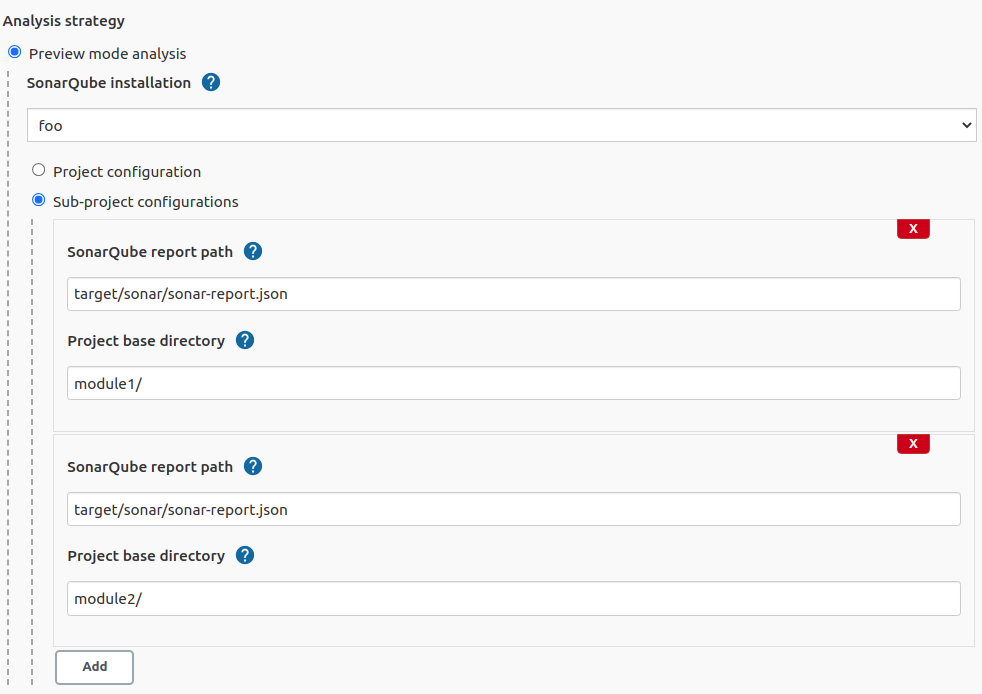
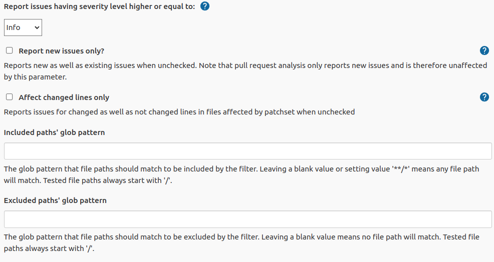
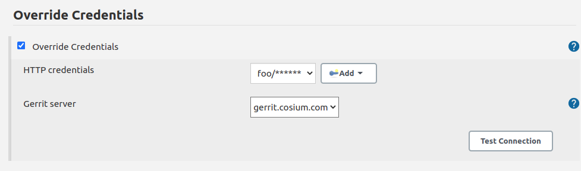

## sonar-gerrit

[](https://ci.jenkins.io/job/Plugins/job/sonar-gerrit-plugin/job/master/)
[](https://github.com/jenkinsci/sonar-gerrit-plugin/graphs/contributors)
[](https://plugins.jenkins.io/sonar-gerrit)
[](https://github.com/jenkinsci/sonar-gerrit-plugin/releases/latest)
[](https://plugins.jenkins.io/sonar-gerrit)

## Introduction

The plugin shares [SonarQube](http://www.sonarqube.org/) feedback with developers
via [Gerrit Code Review](https://www.gerritcodereview.com/).

## Requirements

### Jenkins

Jenkins version 2.249.3 or newer is required.

### SonarQube

SonarQube report generation *must* happen within [SonarQube Scanner](https://plugins.jenkins.io/sonar/) wrapper.

On a non-pipeline job, you can enable [SonarQube Scanner](https://plugins.jenkins.io/sonar/) wrapper by
checking `Prepare SonarQube Scanner environment`:


On a pipeline job, [SonarQube Scanner](https://plugins.jenkins.io/sonar/) wrapper is represented by `withSonarQubeEnv`.
For example:

```groovy
withSonarQubeEnv('my-sonar-installation-name') {
    withMaven(maven: 'my-maven-installation-name') {
        sh "mvn clean verify sonar:sonar -Dsonar.pullrequest.key=${env.GERRIT_CHANGE_NUMBER}-${env.GERRIT_PATCHSET_NUMBER} -Dsonar.pullrequest.base=${env.GERRIT_BRANCH} -Dsonar.pullrequest.branch=${env.GERRIT_REFSPEC}"
    }
}
```

### Gerrit

#### Gerrit Trigger configuration

[Gerrit Trigger](https://plugins.jenkins.io/gerrit-trigger/) plugin should be installed and configured.

Rest API should be configured in the Advanced section of Gerrit Trigger settings.

HTTP authentication data should be set up. Enable Code-Review and Enable Verified checkboxes should be checked on.

For complete guidance please
see [Gerrit Trigger Wiki page](https://plugins.jenkins.io/gerrit-trigger/#plugin-content-setup-requirements).


#### Running out of Gerrit Trigger job

In case when the plugin is runing outside of a job with Gerrit Trigger the next environmental variables should be set:

* `GERRIT_NAME` - Gerrit server name
* `GERRIT_CHANGE_NUMBER` - Change number
* `GERRIT_PATCHSET_NUMBER` - Patchset number

## Setup

### Install plugin

Install the plugin via Jenkins plugin manager. Gerrit Trigger plugin should be also installed and configured.

### Configure build

Sonar Gerrit plugin is intended to run as post-build action. Choose it from available post-build actions.

### Plugin settings

There are several settings allowing to customise the plugin for your needs.

#### SonarQube Settings

##### Pull request analysis (since SonarQube 7.2)

This analysis strategy is based on https://docs.sonarqube.org/latest/analysis/pull-request/ .

The SonarQube instance must either
have [sonarqube-community-branch-plugin](https://github.com/mc1arke/sonarqube-community-branch-plugin)
enabled or be of [developer edition](https://www.sonarqube.org/developer-edition/) type.

In order to run a pull request scan, `Sonar` requires the following mandatory properties:

| Key                      | Recommended value template                        | Example             |
|--------------------------|---------------------------------------------------|---------------------|
| sonar.pullrequest.key    | ${GERRIT_CHANGE_NUMBER}-${GERRIT_PATCHSET_NUMBER} | 250-1               |
| sonar.pullrequest.base   | ${GERRIT_BRANCH}                                  | master              |
| sonar.pullrequest.branch | ${GERRIT_REFSPEC}                                 | refs/changes/01/1/1 |

Example of `Maven` target:

```
clean verify sonar:sonar -Dsonar.pullrequest.key=${GERRIT_CHANGE_NUMBER}-${GERRIT_PATCHSET_NUMBER} -Dsonar.pullrequest.base=${GERRIT_BRANCH} -Dsonar.pullrequest.branch=${GERRIT_REFSPEC}
```

###### Non pipeline


###### Pipeline

```groovy
sonarToGerrit(
        inspectionConfig: [
                analysisStrategy: pullRequest()
        ]
)
```

##### Preview mode analysis (until SonarQube 7.6)

This analysis strategy is intended to work with report provided by SonarQube running on a project in preview mode. That
means SonarQube report generation should be included to build.

If you use Maven, fill out "Goals and options" field in "Build" section of your Jenkins job:

```bash
clean verify sonar:sonar -Dsonar.analysis.mode=preview -Dsonar.report.export.path=sonar-report.json
```

###### Non pipeline

Use setting "Project configuration" if only one SonarQube report is generated and static code analysis of the whole
project is required.



Use setting "Sub-project configurations" to specify modules and paths for separate reports if modules are analysed
separately or not every module needs to be analysed.



Settings:

1. SonarQube installation - The SonarQube installation (see https://plugins.jenkins.io/sonar/) to be used for analysis.
   It is also used to provide a link to a SonarQube rule in Gerrit comments.
2. Project base directory - subdirectory for a case when Jenkins job is related to a specific module of a big project.
   The path is relative to a main project root directory. Default value is empty.
3. SonarQube report path - Path to a SonarQube report generated by SonarQube while a project was being built. The path
   is relative to a build working directory. Default value: `target/sonar/sonar-report.json`
4. Allow auto match - setting to allow automatically match SonarQube issues to Gerrit files in case if project consists
   of several sub-modules, but only one SonarQube report is generated for the whole project.

###### Pipeline

```groovy
sonarToGerrit(
        inspectionConfig: [
                analysisStrategy: previewMode(
                        sonarQubeInstallationName: 'My SonarQube Installation',
                        baseConfig: [
                                projectPath    : '',
                                sonarReportPath: 'target/sonar/sonar-report.json',
                                autoMatch      : true
                        ]
                        // OR
                        //subJobConfigs : [
                        //  [
                        //      projectPath: 'module0',
                        //      sonarReportPath: 'target/sonar/sonar-report.json'
                        //  ],
                        //  [
                        //      projectPath: 'module1',
                        //      sonarReportPath: 'target/module1/sonar/sonar-report.json'
                        //  ]
                        //]
                )
        ]
)
```

#### Filter

Filter is used to specify what issues will be affected in the output:

* to be commented
* to affect review score
* etc

It is possible to filter issues by:

1. Severity - SonarQube issue severity. If user doesn't want issues with low severity to be reported to Gerrit, he (or
   she) can choose the lowest severity level to be reported. For example if "Major" level is selected, information about
   issues with "Major", "Critical" and "Blocker" will be included to Gerrit review. Default value: Info.
2. New issues only - reflects SonarQube issue "new" property. If issue is not marked as new that may be a sign that it
   is not created by processing commit and this issue is not supposed to be included to review.
3. Changed lines only - when only several lines are changed in a commit user may not want other lines to be commented by
   Gerrit. With "Add comments to changed lines only" unchanged in the commit lines will not be commented in Gerrit.
4. Included paths' glob pattern - The glob pattern that file paths should match to be included by the filter. Leaving a blank value or setting value `**/*` means any file path will match. Tested file paths always start with `/`.



#### Review Settings

Review settings contains of issue filter to specify issues to be commented and review template.


##### Review Comment Type

Posted review comments can be of one of the following types :
* `STANDARD` - The usual review comment that everyone use.
* `ROBOT` - Available since Gerrit 2.14. Review comment type to be used by robots. See https://gerrit-review.googlesource.com/Documentation/config-robot-comments.html for more details.

##### Report Formatting

This section allows user to customise text, intended to use as review title and issue comment.

1. Title - Review title settings allow customization of Gerrit review titles for both cases (violations found or not)
   separately. There are several tags to be replaced by real values allowed in this context:
    1. \<info_count> - will be replaced with count of issues having INFO severity level;
    2. \<minor_count> - will be replaced with count of issues having MINOR severity level;
    3. \<major_count> - will be replaced with count of issues having MAJOR severity level;
    4. \<critical_count> - will be replaced with count of issues having CRITICAL severity level;
    5. \<blocker_count> - will be replaced with count of issues having BLOCKER severity level;
    6. \<min_minor_count> - will be replaced with count of issues having MINOR severity level or higher;
    7. \<min_major_count> - will be replaced with count of issues having MAJOR severity level or higher;
    8. \<min_critical_count> - will be replaced with count of issues having CRITICAL severity level or higher;
    9. \<total_count> - will be replaced with total count of issues.
2. Comment - Issue comment pattern. Available tags:
    1. \<key> - will be replaced with issue key;
    2. \<component> - will be replaced with issue component info;
    3. \<message> - will be replaced with issue message;
    4. \<severity> - will be replaced with issue severity;
    5. \<rule> - will be replaced with issue rule name;
    6. \<rule_url> - will be replaced with link to rule description on SonarQube;
    7. \<status> - will be replaced with issue status;
    8. \<creation_date> - will be replaced with issue creation date.

#### Score Settings

Starting with v. 2.1 it's become possible to specify a separate filter for score settings.


1. Post score - This setting describes whether it is necessary to post score to Gerrit or not.
2. Category - Gerrit category used for score posting. Default value: Code-Review.
3. Score for no SonarQube violation found case - Score to be posted to Gerrit. Default value: +1
4. Score for SonarQube violations found case - Score to be posted to Gerrit. Default value: -1

Please note: to use Gerrit category other than Default it is necessary to configure it in Gerrit. See details
in [Gerrit Documentation](https://gerrit-review.googlesource.com/Documentation/config-labels.html).

An example of settings to be added to the project.config for creating Sonar-Verified category:

```
[label "Sonar-Verified"]
    function = MaxWithBlock
    value = -1 Issues found
    value =  0 No score
    value = +1 Verified
    defaultValue = 0
```

And access rights:

```
[access "refs/heads/*"]
    label-Sonar-Verified = -1..+1 group Project Owners
    label-Sonar-Verified = -1..+1 group Non-Interactive Users
```

#### Credentials override

To override the credentials used to post comments on the job level set up section "Override default HTTP credentials". (
Global credentials on the Gerrit Trigger Server level should be set up as well for Gerrit Trigger needs.)



1. Override default HTTP credentials? - This setting describes whether it is necessary to override Gerrit credentials
   from the Gerrit Trigger Server settings or not.
2. HTTP credentials - Credentials to be used to post review result to Gerrit.
3. Gerrit Server - The server used to check connection with overridden credentials. The value *does not* affect plugin
   settings and only used to verify credentials.

#### Notification Settings

This functionality works when Gerrit is configured with post server settings.

1. To be notified if no SonarQube violations found - Choice of persons to be notified. Default value: None.
2. To be notified if SonarQube violations found - Choice of persons to be notified. Default value: Owner.
3. To be notified if negative score is posted - Choice of persons to be notified. Default value: Owner.

Options :

* None - No notification regarding particular review will be sent.
* Owner - Notification with review results will be sent to a change owner.
* Owner & Reviewers - Notification with review results will be sent to an owner and to all the change reviewers added to
  the change.
* All - Everyone in Gerrit project will receive notification.


## Pipeline full examples

### Pull request analysis (since SonarQube 7.2)

```groovy
node {
   stage('Build') {
      // trigger build
      git url: 'ssh://your_project_repo'
      // Fetch the changeset to a local branch using the build parameters provided to the build by the Gerrit Trigger...
      def changeBranch = "change-${env.GERRIT_CHANGE_NUMBER}-${env.GERRIT_PATCHSET_NUMBER}"
      sh "git fetch origin ${env.GERRIT_REFSPEC}:${changeBranch}"
      sh "git checkout ${changeBranch}"
      try {
         withSonarQubeEnv('my-sonar-installation') {
            withMaven(maven: 'my-maven-installation') {
               sh "mvn clean verify sonar:sonar -Dsonar.pullrequest.key=${env.GERRIT_CHANGE_NUMBER}-${env.GERRIT_PATCHSET_NUMBER} -Dsonar.pullrequest.base=${env.GERRIT_BRANCH} -Dsonar.pullrequest.branch=${env.GERRIT_REFSPEC}"
            }
         }
      } finally {
         sonarToGerrit(
                 inspectionConfig: [
                         analysisStrategy: pullRequest()
                 ]
                 /* Optional parameters
                 , reviewConfig: [
                         commentType: 'STANDARD', // 'STANDARD' or 'ROBOT'
                         issueFilterConfig      : [
                                 severity        : 'INFO',
                                 newIssuesOnly   : false,
                                 changedLinesOnly: false,
                                 includedPathsGlobPattern: null,
                         ],
                         noIssuesTitleTemplate  : 'SonarQube violations have not been found.',
                         someIssuesTitleTemplate: '<total_count> SonarQube violations have been found.',
                         issueCommentTemplate   : '<severity> SonarQube violation:\n\n\n<message>\n\n\nRead more: <rule_url>'
                 ],
                 scoreConfig: [
                         issueFilterConfig: [
                                 severity        : 'INFO',
                                 newIssuesOnly   : false,
                                 changedLinesOnly: false,
                                 includedPathsGlobPattern: null,
                         ],
                         category         : 'Code-Review',
                         noIssuesScore    : 0,
                         issuesScore      : -1
                 ],
                 notificationConfig: [
                         noIssuesNotificationRecipient       : 'NONE',
                         commentedIssuesNotificationRecipient: 'OWNER',
                         negativeScoreNotificationRecipient  : 'OWNER'
                 ],
                 authConfig: [
                         httpCredentialsId: 'b948c0ba-51a2-4eb7-b42b-71e6a77d7d34'
                 ]*/
         )
      }
   }
}

```

### Preview mode analysis (until SonarQube 7.6)

```groovy
node {
   stage('Build') {
      // trigger build
      git url: 'ssh://your_project_repo'
      // Fetch the changeset to a local branch using the build parameters provided to the build by the Gerrit Trigger...
      def changeBranch = "change-${env.GERRIT_CHANGE_NUMBER}-${env.GERRIT_PATCHSET_NUMBER}"
      sh "git fetch origin ${env.GERRIT_REFSPEC}:${changeBranch}"
      sh "git checkout ${changeBranch}"
      try {
         withSonarQubeEnv('my-sonar-installation') {
            withMaven(maven: 'my-maven-installation') {
               sh "mvn clean verify sonar:sonar -Dsonar.analysis.mode=preview -Dsonar.report.export.path=sonar-report.json"
            }
         }
      } finally {
         sonarToGerrit(
                 inspectionConfig: [
                         analysisStrategy: previewMode(
                                 sonarQubeInstallationName: 'My SonarQube Installation',
                                 baseConfig: [
                                         projectPath    : '',
                                         sonarReportPath: 'target/sonar/sonar-report.json',
                                         autoMatch      : true
                                 ]
                                 // OR
                                 //subJobConfigs : [
                                 //  [
                                 //      projectPath: 'module0',
                                 //      sonarReportPath: 'target/sonar/sonar-report.json'
                                 //  ],
                                 //  [
                                 //      projectPath: 'module1',
                                 //      sonarReportPath: 'target/module1/sonar/sonar-report.json'
                                 //  ]
                                 //]
                         )
                 ]
                 /* Optional parameters
                 , reviewConfig: [
                         commentType: 'STANDARD', // 'STANDARD' or 'ROBOT'
                         issueFilterConfig      : [
                                 severity        : 'INFO',
                                 newIssuesOnly   : false,
                                 changedLinesOnly: false,
                                 includedPathsGlobPattern: null,
                         ],
                         noIssuesTitleTemplate  : 'SonarQube violations have not been found.',
                         someIssuesTitleTemplate: '<total_count> SonarQube violations have been found.',
                         issueCommentTemplate   : '<severity> SonarQube violation:\n\n\n<message>\n\n\nRead more: <rule_url>'
                 ],
                 scoreConfig: [
                         issueFilterConfig: [
                                 severity        : 'INFO',
                                 newIssuesOnly   : false,
                                 changedLinesOnly: false,
                                 includedPathsGlobPattern: null,
                         ],
                         category         : 'Code-Review',
                         noIssuesScore    : 0,
                         issuesScore      : -1
                 ],
                 notificationConfig: [
                         noIssuesNotificationRecipient       : 'NONE',
                         commentedIssuesNotificationRecipient: 'OWNER',
                         negativeScoreNotificationRecipient  : 'OWNER'
                 ],
                 authConfig: [
                         httpCredentialsId: 'b948c0ba-51a2-4eb7-b42b-71e6a77d7d34'
                 ]*/
         )
      }
   }
}
```

## Result example

### Result of plugin work in Gerrit history:


### Gerrit commit


### Score posted


## Troubleshooting

### Plugin fails build with message "Unable to post review. Request failed"

This message occurres when RestAPIException is thrown by Gerrit API on attempt to post request.

Since version 1.0.7 it is possible to obtain a full stacktrace of the exception using a logger for
class `org.jenkinsci.plugins.sonargerrit.SonarToGerritPublisher`


The log will contain necessary information about the exception as follows:


## Version incompatibilities

### Version 1.0.5

In this version plugin settings has moved from Build Steps to Post Build Actions. User needs to reconfigure jobs, or
settings will be erased to default.

## Issues

Report issues and enhancements in
the [Issue tracker](https://issues.jenkins.io/issues/?jql=resolution%20is%20EMPTY%20and%20component%3D20853).

## Contributing

Refer to our [contribution guidelines](https://github.com/jenkinsci/.github/blob/master/CONTRIBUTING.md)

## License

Licensed under MIT, see [LICENSE](LICENSE.md)
